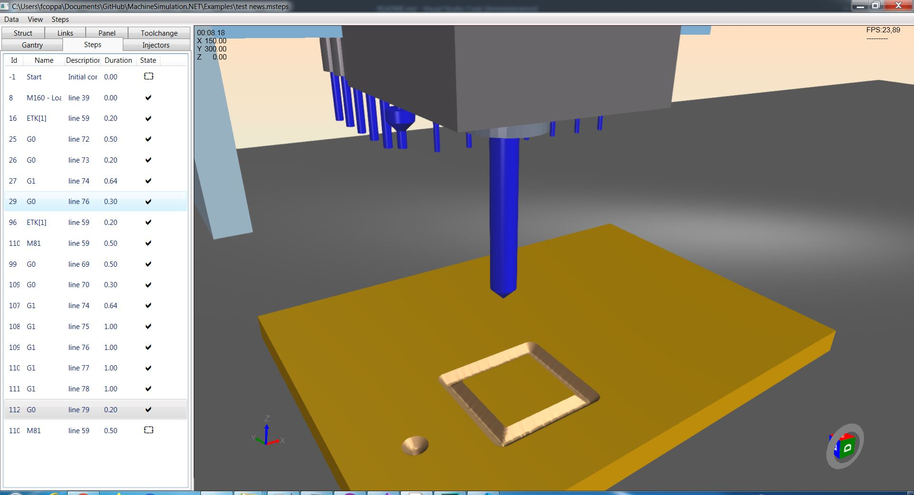
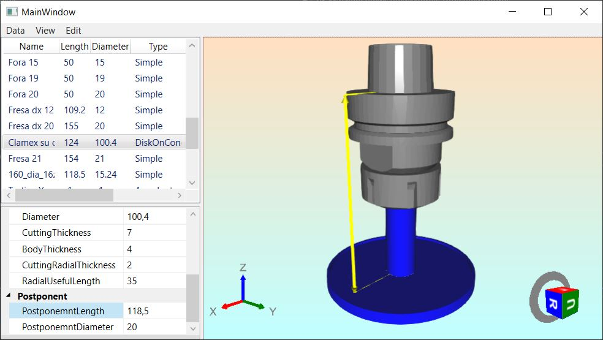

# MachineSimulation.NET
This project is an evolution of [**MachineSimulation.DX**](https://github.com/federicocoppa75/MachineSimulation.DX):
* switch from .NET Framework to .NET Core and .NET Standard;
* load machine data from server REST;
* remove dependencies from MVVMLightLib;
* more light viewmodels;
* more efficient material removal library;
* manage different type of tools in material removal;
* more decouplig between modules.

## Client
Application for load machine element models file (*.stl) and post it to data server. 
## Client.Machine
Application for load machine structure file (*.xml) made by [**MachineEditor**](https://github.com/federicocoppa75/MachineEditor#machineeditor) and post to data server or save as JSON file.

## Client.Tooling
Application for load machine tooling file (*.tooling) made by [**ToolingEditor**](https://github.com/federicocoppa75/MachineEditor#toolingeditor) ad post to data server or save as jTooling file (JSON format).

## Client.Tools
Application for load tools file (*.tools) made by [**ToolEditor**](https://github.com/federicocoppa75/MachineEditor#toolingeditor) ad post to data server or save ad JTools file (JSON format).

## Example
This folder contains the files to simulate a simple 3 axis CNC being machined.
* Simple3AxesCnc.json: machine structure
* Models: contains machene elements models (*.stl file)
* SimpleToolSet.jTools: tools database
* SimpleTooling.jTooling: tooling example
* SimpleTooling2.jTooling: tooling for execute test *test news.msteps*
* Simple3AxesCnc.jenv: working environment (contains structure, elements model, tools and tooling)
* Simple3AxesCnc(news).jenv: work environment for execute *test news.msteps*
* antina.msteps: example of machinary
* test news.msteps: example of new developments

## Machine.3D.Geometry.Provider
Module for decouple the machine elements model loading.

## Machine.3D.Views
Implementation of 3D view, depends on [**helix-toolkit**](https://github.com/helix-toolkit/helix-toolkit) and decouple it from the other modules.

## Machine.Data
Data model class library.

## Machine.Data.Base
Class library of base struct used by [Machine.Data](#Machine.Data).

## Machine.Data.Converters
Class library of converters used to serialize/deserialize data models.

## Machine.DataSource.Client.Rest
Class library for read/write data model from server rest.

## Machine.DataSource.File.Json
Class library for read/write data model from JSON file.

## Machine.DataSource.File.Xml
Class library for read data model from XML file.

## Machine.Editor
Application for edit the machine struct, the data could be load from files made by the applications of this solution or by data server.

## Machine.Steps.ViewModels
Class library for define the viewmodels for manage machine steps.

## Machine.StepsSource.File.Iso
Module for read and convert ISO file to machine steps.

## Machine.StepsSource.File.Msteps
Module for load machine steps from file.

## Machine.Viewer
Application for view the machine with relative tooling, the data could be load from files made by the applications of this solution or by data server.

## Machine.ViewModels
ViewModels class library.

## Machine.ViewModels.Base
Class library for base elements for MVVM patterns implementation

## Machine.ViewModels.Ioc
Simple implemention of "Inversione of control".

## Machine.ViewModels.Messaging
Messaging implementation.

## Machine.Views
Data view class library.

## MaterialRemove.Interfaces
Class library thet defines the intarfaces to interact to material removal libraries.

## MaterialRemove.Machine.Bridge
Class library to implement the necessary coupling between material removal ([MaterialRemove.ViewModels](#MaterialRemove.ViewModels)) library and the other viewmodels ([Machine.ViewModels](#Machine.ViewModels)).

## MaterialRemove.Test
Test application used to test and develop material removal library.

## MaterialRemove.ViewModels
Class library that implements the material removal.

## MaterialRemove.ViewModels.3D
Partial implementtion of [MaterialRemove.ViewModels](#MaterialRemove.ViewModels) that depends on [helix-toolkit](https://github.com/helix-toolkit/helix-toolkit): in this way the core of material removal is decoupled from that library.

## Mesh.Data
Machine element models data model library.
## Server
Server REST for store and get machine data (structure, tooling, elements models). The data is stored by SQLite.

## Tools.Editor
Application for edit tool set, the data could be load from files made by the applications of this solution or by data server.

